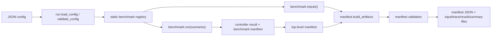
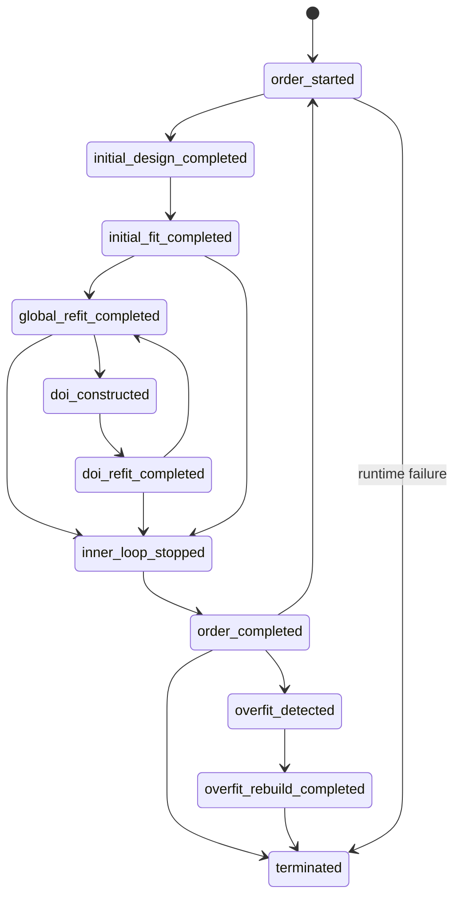

# UQRA ARCH-01 自适应子系统架构审计

状态：完成

审计基线：`master` merge commit `564a70325ac7a7850ac254ce037ccb21d1235406`

范围：`uqra/adaptive/`、runner、schema、reduced benchmark、证据生成入口

性质：只读架构审计；不修改算法、公共 API、数学契约或冻结发布证据

## 1. 系统摘要与边界

UQRA 是 Python 库；自适应子系统在 `uqra/adaptive/` 中实现确定性的 sparse-PCE
控制、样本选择、DoI、状态追踪、reduced software benchmark 和可审计产物生成。
包的公开命令 `uqra-adaptive-runner` 指向 `uqra.adaptive.run:main`
（[`pyproject.toml`](../pyproject.toml) 第 38--39 行）。正式质量环境是 Windows、
Python 3.12；CI 的 Windows job 执行 compatibility/schema/warning suite，Ubuntu job
只聚合 Windows 结果（[`.github/workflows/adaptive-compatibility.yml`](../.github/workflows/adaptive-compatibility.yml)
第 9--32、85--93 行）。

本审计不把 `history.py` / `regression.py` 的历史诊断扩大为 M6 Legacy 证据治理，也不把
三个 reduced benchmark 解释为历史 replay、论文生产或 scientific reproduction。
config v2 与 manifest v2 都把 `purpose=software_benchmark`、`scale=reduced` 固定为
常量；manifest 还要求 reduced benchmark 的 `historical_replay=false` 和
`paper_production=false`（[`schemas/adaptive-runner-config-v2.schema.json`](../schemas/adaptive-runner-config-v2.schema.json)
第 5--18 行；[`schemas/adaptive-runner-manifest-v2.schema.json`](../schemas/adaptive-runner-manifest-v2.schema.json)
第 137--160 行）。

## 2. 仓库图与职责

```text
pyproject.toml                         包元数据与 CLI 注册
uqra/adaptive/
  run.py                              config/CLI 编排与顶层 manifest
  benchmark_registry.py               配置可见的静态 benchmark 白名单
  benchmark.py                        Phase 8 多终态兼容 benchmark
  *_reduced.py                        FourBranch/Ishigami/Gayton 固定夹具
  reduced_fixture.py                  Ishigami/Gayton 的共享 reduced 执行契约
  controller.py                       两级 adaptive sparse-PCE 状态机
  state.py                            候选池身份、累计观测与不变量
  sparse_pce.py                       legacy preprocessing、LARS/CV 与最终拟合
  optimal_design.py                   RRQR、D/S 分数与增量设计
  doi.py                              DoI 构造和 local/global ID 映射
  profiles.py                         compatibility 参数与运行前校验
  manifest.py                         provenance、artifact 身份和磁盘写入
  regression.py / history.py          回归与历史诊断辅助入口
schemas/                              config、manifest、trace 的发布契约
tests/compatibility/                  正式行为、身份、runner/schema 回归
```

`uqra.adaptive` 的显式公开 Python API 由 `__all__` 给出，包括 controller/state、DoI、
optimal design、sparse-PCE、profiles 以及 regression/history 辅助函数
（[`uqra/adaptive/__init__.py`](../uqra/adaptive/__init__.py) 第 2--25 行）。
benchmark registry 则是另一条配置可见边界：它只保存 UQRA 自有 callable，配置不能
传入模块或 import path（[`uqra/adaptive/benchmark_registry.py`](../uqra/adaptive/benchmark_registry.py)
第 1--5、27--60 行）。

## 3. 入口与组件契约

| 组件 | 责任 | 输入 | 输出/状态 | 直接依赖 |
| --- | --- | --- | --- | --- |
| `run.py` | 严格校验 config、选择 benchmark、组合并写出证据包 | JSON config、可选输出路径 | manifest v2、`.npy` 输入、trace/result/summary JSON | registry、manifest |
| `benchmark_registry.py` | 将公开 benchmark 名映射到固定 scenarios、runner 与 inputs | benchmark 名 | `BenchmarkDefinition` | 四组 benchmark 模块 |
| `*_reduced.py` / `reduced_fixture.py` | 固定 seed/输入身份、模型、基函数、QoI/DoI 参数与禁止声明 | 无外部数据；固定配置 | benchmark manifest 与逐轮 trace | controller、profiles、state、polynomial |
| `controller.py` | 执行 order/inner-loop/DoI/refit/overfit/termination 状态机 | 冻结候选池、函数型 model/vandermonde/QoI、profile | `AdaptiveResult`、`AdaptiveState`、`RoundTrace[]` | state、sparse_pce、optimal_design、doi |
| `state.py` | 维护 immutable candidate identity、global IDs、累计观测与映射不变量 | candidate array、待评估 global IDs | 观测映射、计数、身份 hashes | NumPy、model callable |
| `sparse_pce.py` | legacy 加权预处理、LARS active path、固定 KFold CV、OLS refit | design matrix、response、CV 参数 | `SparsePCEFit` | NumPy、scikit-learn |
| `optimal_design.py` | RRQR 初始化与 D/S-optimal 贪心增量选择 | basis matrix、selected/candidate IDs | 有序 global/local IDs | NumPy、SciPy |
| `doi.py` | 按中心/半径和 fallback 构造 DoI | candidate、未评估 IDs、中心 | `DomainOfInterest` | NumPy |
| `manifest.py` | 收集 Git/环境/源码树身份并生成 artifact inventory | benchmark manifest、输入 arrays、输出路径 | provenance、文件 bytes 与 SHA-256 | Git 子进程、NumPy/SciPy/sklearn |
| `schemas/` | 发布 config/manifest/trace 的 JSON Schema 契约 | JSON instance | Draft 2020-12 validation | JSON Schema validator（测试侧） |

运行时 `validate_config` 拒绝缺字段、未知字段、非 reduced software benchmark、未知
benchmark/scenario 以及重复 scenario（[`uqra/adaptive/run.py`](../uqra/adaptive/run.py)
第 32--74 行）。config v1 只能选择 Phase 8；config v2 才能通过静态 registry 选择
三个 reduced benchmark（同文件第 56--67 行）。

## 4. 运行、状态与数据流

### 4.1 Runner 与证据包



1. CLI 或 `run_config` 进入 `run.py`。CLI 先读 UTF-8 JSON，再走相同的
   `validate_config`（[`uqra/adaptive/run.py`](../uqra/adaptive/run.py) 第 77--83、164--183 行）。
2. `_run_config_bundle` 从静态 registry 取得 runner，执行选定 scenarios，并取得同一
   benchmark 的冻结输入（同文件第 124--145 行）。
3. `provenance` 记录 commit、branch、dirty、源码树、依赖版本和复现命令
   （[`uqra/adaptive/manifest.py`](../uqra/adaptive/manifest.py) 第 33--72 行）。
4. `build_artifacts` 将输入序列化为禁止 pickle 的 `.npy`，将每个 scenario 拆成 trace
   与 result，并给每个实际 payload 记录大小和 SHA-256（同文件第 80--134 行）。
5. stable manifest hash 排除 provenance 与 benchmark 内部 Git 元数据，随后运行时
   重新验证关键不变量（[`uqra/adaptive/run.py`](../uqra/adaptive/run.py) 第 86--120、
   138--145 行）。

### 4.2 Adaptive 状态机



1. 每个 polynomial order 构造 Vandermonde matrix，计算 target/budget，并用
   `greedy_optimal_ids` 增加尚未评估的 global IDs
   （[`uqra/adaptive/controller.py`](../uqra/adaptive/controller.py) 第 157--172、252--268 行）。
2. `AdaptiveState.evaluate_new` 在调用模型前拒绝重复、越界或同坐标 ID；成功后按请求
   顺序累计 ID、坐标 hash 与 response（[`uqra/adaptive/state.py`](../uqra/adaptive/state.py)
   第 53--89 行）。
3. `_fit` 始终按累计 `evaluated_global_ids` 取训练数据；LARS active path 逐 prefix 做
   固定 KFold CV，最早最小误差 prefix 为声明的 tie rule
   （[`uqra/adaptive/controller.py`](../uqra/adaptive/controller.py) 第 105--117 行；
   [`uqra/adaptive/sparse_pce.py`](../uqra/adaptive/sparse_pce.py) 第 67--105 行）。
4. inner loop 先做 global optimal-design 增量与 refit；若配置 DoI，则构造 DoI、把 local
   row 映射回 global ID、评估并再次 refit，直至 QoI 稳定、无新增、预算/候选耗尽或达到
   inner iteration 上限（[`uqra/adaptive/controller.py`](../uqra/adaptive/controller.py)
   第 174--250 行）。
5. order 完成后检查 overfit rebuild、outer QoI 收敛或最大 order；所有异常收敛到
   `runtime_failure` 终态（同文件第 252--295 行）。
6. 每次 transition 复制当时的 evaluated IDs、active path、CV path、QoI、预算、计数、
   candidate hash 与错误字段到 `RoundTrace`（同文件第 128--155 行）；trace schema 要求
   这些字段完整存在（[`schemas/adaptive-trace.schema.json`](../schemas/adaptive-trace.schema.json)
   第 7--42 行）。

## 5. 公共与数学契约边界

以下变更必须视为潜在的公共或数学契约变化，并在后续 OPT 工作中保持不变，除非另行批准：

- `uqra.adaptive.__all__` 的公开符号、`uqra-adaptive-runner` CLI 参数与退出行为；
- config/manifest/trace schema URI、字段集合、常量、hash scope 与 artifact 布局；
- registry 中 benchmark 名称、scenario 集合及“不得加载用户模块”的安全边界；
- 候选点字节身份、global ID 顺序、累计观测顺序、DoI local-to-global 映射；
- polynomial order、每轮 target/budget、设计点选择及稳定 tie rule；
- legacy preprocessing、LARS active path/prefix、CV folds/seed、系数/intercept/CV error；
- QoI、Pf/variance/reference metric、停止状态与停止原因；
- raw trace hash 与排除 `cv_path`/`qoi` 的跨平台 contract trace hash。该排除范围在
  [`uqra/adaptive/reduced_fixture.py`](../uqra/adaptive/reduced_fixture.py) 第 22--30 行和
  manifest schema 第 88--99 行明确声明，不能把 contract hash 相等解释成浮点诊断相等；
- reduced benchmark 的 seed、shape、input hash、`software_benchmark/reduced` 身份以及
  `historical_replay=false`、`paper_production=false`。

## 6. 依赖方向与耦合观察

确认的主依赖方向是：

```text
CLI/run -> registry -> benchmark fixture -> controller
controller -> state + sparse_pce + optimal_design + doi + profile
run -> manifest/artifact writer
published schemas/tests -> verify runner outputs and contracts
```

未发现 core numerics 反向依赖 runner、schema 或 artifact writer。外部运行时边界为 NumPy、
SciPy、scikit-learn；provenance 另调用本地 Git。benchmark 层延迟导入 UQRA polynomial
实现，例如 FourBranch 的 Hermite Vandermonde
（[`uqra/adaptive/four_branch_reduced.py`](../uqra/adaptive/four_branch_reduced.py) 第 64--66 行）。

已确认的结构性风险边界如下，仅供 TEST-01/OPT-01 排序，不在 ARCH-01 中修复：

1. **双重契约维护。** Python `validate_config`/`validate_manifest` 与五份 JSON Schema
   分别维护约束；测试目前承担防漂移职责。新增字段、benchmark 或 scenario 时必须同步
   runtime、schema、registry 和测试。
2. **benchmark 装配重复。** FourBranch 自行装配 runner/manifest，而 Ishigami 与 Gayton
   使用 `run_reduced_fixture`；两条路径产生同一 published manifest 形状但拥有不同实现点。
3. **controller 责任集中。** `AdaptiveSparsePCE` 同时拥有状态机、设计、模型评估、拟合、
   QoI、停止判据、trace 和异常终止编排；任何低风险拆分都必须以完整逐轮等价为门。
4. **可复现性分层。** 离散 contract trace 明确排除 `cv_path` 与 `qoi`，raw trace 才覆盖
   全精度值；后续测试与性能比较必须明确使用哪一层，不得只比较最终 Pf 或 contract hash。
5. **工作树敏感 provenance。** `source_tree_identity` 哈希 Git 已跟踪文件和未忽略的未跟踪
   文件（`git ls-files --cached --others --exclude-standard`），因此同一 commit 的 provenance
   source-tree hash 可因本地未跟踪文件不同而变化；stable manifest hash 有意排除 provenance。
6. **异常归一化。** controller 把运行期异常转为 `runtime_failure` trace/result；CLI 只把
   config/manifest `ValueError` 转为 argparse error。调用方必须区分有效的失败场景产物与
   CLI 契约错误。

## 7. 验证证据与未知项

本审计以源码、发布 schema、`pyproject.toml`、正式 workflow 和 compatibility tests 交叉
核对；未修改或执行生产 benchmark。ARCH-01 的完成门是架构可审计文档，不是 TEST-01
覆盖结论或 PERF-01 性能数据。

仍待后续任务回答：

- **TEST-01：** 哪些逐轮字段、失败路径、runtime/schema 漂移和两条 reduced 装配路径尚无
  高价值回归测试；
- **PERF-01：** controller、optimal-design、LARS/CV、artifact serialization 各自的时间和
  峰值内存占比；
- **Inference：** `AdaptiveSparsePCE.random_state` 当前只保存于实例，而实际 CV 随机性来自
  profile 的 `cv_seed`。是否保留该参数作为未来契约或兼容占位，源码没有说明；改变前需要
  历史文档/调用方证据。
- **Inference：** `regression.py` 与 `history.py` 通过 `uqra.adaptive.__all__` 暴露，但主要
  服务兼容性诊断。它们是否承诺与 controller 同等级的长期公共 API，仓库尚无独立版本化
  政策；在取得调用方证据前应按现有公共导出保护。

## 8. ARCH-01 结论

入口、依赖方向、状态流、数据流、公共契约和风险边界均已定位到源码或发布 schema。
当前结构没有需要在 ARCH-01 中紧急修改的生产缺陷；下一步应按计划执行 TEST-01 和
PERF-01，以行为覆盖与测量证据约束后续 OPT-01/02。OPT-03 仍须单独裁决。
